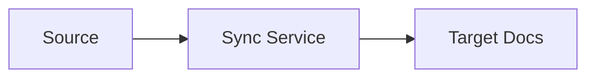

# SDLC Architecture

## Prerequisites

- Approved `requirements.md` exists. If not, stop and run Stage 1.

## Steps

1. Map requirements to components and data flows for a **Python web application**.
2. Prefer simple, maintainable designs; justify Flask / FastAPI / Django (or approved equivalent).
3. Write `architecture.md` using the template.
4. Include at least one mermaid diagram.
5. Note Stage 7 **Playwright** E2E against the web UI.
6. Write `docs/sdlc/02-architecture-response.md` and open the Stage 2 PR.
7. Stop for human approval before design review.

## Required sections

Write `architecture.md` with these headings:

1. `# Architecture`
2. `## Overview`
3. `## Goals & Constraints (from requirements)`
4. `## Component Diagram (mermaid)` — include a `mermaid` fenced diagram (flowchart or sequence)
5. `## Components & Responsibilities` — table: Component | Responsibility
6. `## Data Flow`
7. `## Technology Choices (with rationale)` — default **Python web application**
8. `## Interfaces / Contracts`
9. `## Security & Secret Handling`
10. `## Failure Modes & Resilience`
11. `## Open Trade-offs`

Example mermaid shape:

## Done when

- Every major acceptance criterion maps to a component or flow
- Security and failure modes addressed
- User approves `architecture.md`
