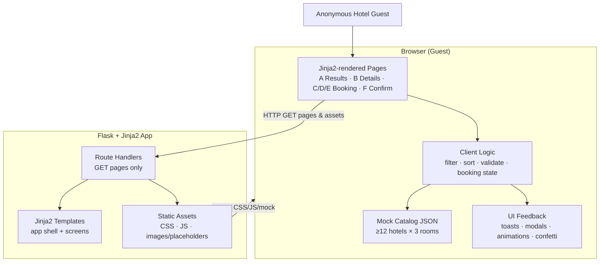

# Architecture

## Overview

This architecture defines a **Python web application** that serves an **Interactive Hotel Booking User Portal** for Jira epic **EP-1** (child stories EP-3–EP-14). A **Flask** app with **Jinja2** templates delivers multi-page HTML and static CSS/JS. All hotel and booking catalog data lives in **client-side mock JSON** (hardcoded JavaScript)—there is no database, authentication, remote hotel API, or real payment gateway.

Guests progress through: **Results (A)** → **Hotel Details (B)** → **Room Selection (C)** → **Guest Details (D)** → **Dummy Payment (E)** → **Confirmation (F)** with confetti. Filtering, sorting, form validation, and booking state are handled in the browser against the mock dataset so local interactions can meet the ~**200ms** feedback target. Stage 7 verification will use **Playwright** end-to-end tests against the served UI.

## Goals & Constraints (from requirements)

| Goal / Constraint | Architectural implication |
|-------------------|---------------------------|
| Flask + Jinja2 Python web app serves pages & static assets | Thin server: routing + template render + `static/` only |
| No DB, auth, real payments, or live hotel APIs | No ORM, sessions for login, or payment SDKs; mock data in JS |
| ≥12 hotels × 3 rooms in mock JSON | Single client-side catalog module; schema supports filters/details/booking |
| Filters: price, rating, amenities; sort by price; Clear filters | Client-side filter/sort engine on Results (A); sort **low→high and high→low** |
| 3-step booking with step indicator | Shared booking shell for C/D/E; booking draft in **`sessionStorage`** |
| Visual feedback on every primary action | Shared UI feedback component (toast/modal/animation) |
| Confirmation + confetti; optional reference id | Confirmation page + **small vanilla JS confetti helper**; reference id `HB-` + timestamp/random |
| Responsive desktop / tablet / mobile | Responsive CSS in app shell; semantic HTML |
| ≤200ms local interactions | Sync filter/sort/step transitions; no network round-trips for catalog ops |
| Graceful empty / validation / `"Not Found"` | Defensive render helpers; empty-state UI; inline form errors |
| No secrets in UI or docs | No credentials in templates, static JS, or architecture docs |
| Stage 7 Playwright E2E | Stable routes, `data-testid` hooks, deterministic mock data |

## Component Diagram (mermaid)



```mermaid
sequenceDiagram
  actor Guest
  participant Flask as Flask App
  participant Page as Browser Page
  participant Mock as Mock JSON
  participant FB as Feedback UI

  Guest->>Flask: GET / (Results A)
  Flask-->>Guest: HTML + static CSS/JS
  Page->>Mock: Load catalog
  Guest->>Page: Filter / sort
  Page->>Mock: Apply filters/sort locally
  Page->>FB: Toast / animation ≤200ms
  Guest->>Flask: GET /hotels/{id} (Details B)
  Flask-->>Guest: Details template
  Guest->>Flask: GET /book/... (Steps C→D→E)
  Note over Page: sessionStorage holds BookingDraft
  Guest->>Page: Pay / Confirm (simulation)
  Page->>FB: Loading then confetti
  Guest->>Flask: GET /confirmation (F)
  Flask-->>Guest: Confirmation shell; JS reads draft + confetti
```

## Components & Responsibilities

| Component | Responsibility |
|-----------|----------------|
| **Flask application factory / entry** | Create app, register blueprints/routes, configure static folder; local/dev runnable only |
| **Route handlers** | Map URLs to screens A–F; pass minimal template context (page title, hotel id for details); no business persistence |
| **Jinja2 templates (app shell)** | Shared layout: nav, responsive breakpoints, feedback region hooks, links across screens (EP-3) |
| **Results page (A)** | Hotel cards from mock data; wire filter/sort UI; empty state; navigate to details |
| **Hotel details page (B)** | Hotel info + 3 room types; “Select room” seeds draft and enters booking at C (room may be changed on C) |
| **Booking step pages (C/D/E)** | Step indicator (1 of 3); Room Selection → Guest Details → Dummy Payment; Back/Continue use `sessionStorage` draft |
| **Confirmation page (F)** | Booking summary, confetti, CTA back to results |
| **Mock catalog module (JS)** | Hardcoded ≥12 hotels × 3 rooms; fields for name, location, rating, amenities, prices, images/placeholders, room capacity/amenities |
| **Filter & sort engine (JS)** | Price range, rating, amenities multi-select, Clear filters; sort by price **low→high and high→low** (sort key: hotel `priceRange.min` / equivalent display min) |
| **Booking state manager (JS)** | Persist `BookingDraft` in **`sessionStorage`** across C→F (same tab); survive refresh; clear when tab closes; no server session |
| **Form validation (JS)** | Inline validation for Guest Details (required names, email format, guests ≥ 1; optional phone) |
| **UI feedback layer (JS/CSS)** | Toasts, modals, animations for primary actions; payment loading; **small vanilla JS confetti helper** on success (no heavy dependency) |
| **Display helpers (JS)** | Render missing mock fields as `"Not Found"` / placeholder; never crash |
| **Static CSS** | Responsive layout, card/list/booking/confirmation presentation |
| **Playwright E2E (Stage 7)** | Drive browse → filter/sort → details → 3-step book → confirm against live Flask server |

**Requirement mapping (summary):** FR1–2 → Flask + static/mock; FR3–7 → mock + Results filter/sort/empty; FR8 → Details; FR9–12 → booking C/D/E; FR13 → Confirmation; FR14–15 → feedback + Not Found; FR16–17 → no auth/secrets; NFRs → responsive CSS, client-side perf, Playwright.

## Data Flow

1. **Page load:** Guest requests a route → Flask returns Jinja2 HTML → browser loads CSS/JS (including mock catalog).
2. **Browse (A):** Client reads mock JSON → renders cards → guest applies filters/sort → engine recomputes in memory → UI updates with visual feedback (target ≤200ms). Empty matches → empty-state view.
3. **Details (B):** Navigation with hotel id (path) → template loads → JS resolves hotel from mock → shows hotel + 3 rooms; missing fields → `"Not Found"`. “Select room” navigates to booking step C with `hotelId` + optional pre-selected `roomId` written to `sessionStorage`.
4. **Booking (C→E):** Step C requires exactly one room (pre-selected from B or chosen on C) before Continue; draft is read/written via **`sessionStorage`**. Guest Details validates locally; Dummy Payment runs success-only simulation (loading feedback, no network payment call) → client generates **`referenceId`** (`HB-` + timestamp/random) before advancing to F.
5. **Confirmation (F):** Page reads summary from `sessionStorage` draft → confetti (vanilla helper) → CTA clears draft (optional) and returns to Results. Same-tab refresh mid-flow restores draft from `sessionStorage`.
6. **No server write path:** Flask never persists bookings, users, or payments; catalog stays in mock JS; booking draft is browser-tab scoped only.

## Technology Choices (with rationale)

| Choice | Decision | Rationale |
|--------|----------|-----------|
| **Language / runtime** | Python 3 | Capstone default; Stage 5 implementation target |
| **Web framework** | **Flask** | Approved in requirements; minimal surface for serving multi-page HTML + static files without unused Django/FastAPI weight (no ORM, no API-first JSON backend) |
| **Templating** | **Jinja2** (Flask default) | Server-rendered shell and screen structure; keeps HTML maintainable while business data stays in JS mock JSON |
| **Why not FastAPI** | Rejected for primary UI | Excellent for APIs; this product is multi-page HTML with Jinja2, not a JSON API + SPA |
| **Why not Django** | Rejected | Heavier (admin, ORM, auth patterns) unused given no DB/auth |
| **Client data** | Hardcoded JS mock JSON | Matches EP-4 and “no persistent backend”; enables ≤200ms local filter/sort |
| **Client interactivity** | **Vanilla JS** | Sufficient for filter/sort/forms/feedback; no SPA framework |
| **Styling** | Static CSS (responsive) | Meet breakpoints without requiring a heavy design system |
| **Animations** | CSS transitions + **small vanilla JS confetti helper** (no npm confetti package) | Satisfies EP-12/EP-13; keeps deps minimal for Stage 5/7 |
| **Booking draft persistence** | **`sessionStorage`** (not `localStorage`, not server) | Survives refresh within the same tab for Back/Continue and demo/Playwright; clears when the tab closes; not a DB |
| **Server persistence** | None | Out of scope — no DB/ORM |
| **Testing (Stage 7)** | Playwright MCP E2E + pytest for Flask routes/smoke | Browser journey coverage + light server health checks |

## Interfaces / Contracts

### HTTP routes (page contracts)

| Method | Path (illustrative) | Screen | Notes |
|--------|---------------------|--------|-------|
| `GET` | `/` or `/results` | A — Results | Lists hotels from client mock after load |
| `GET` | `/hotels/<hotel_id>` | B — Details | `hotel_id` must exist in mock; unknown id → graceful not-found UI |
| `GET` | `/book/<hotel_id>/room` | C — Room Selection | Step 1 of 3 |
| `GET` | `/book/<hotel_id>/guest` | D — Guest Details | Step 2 of 3 |
| `GET` | `/book/<hotel_id>/payment` | E — Dummy Payment | Step 3 of 3; simulation banner required |
| `GET` | `/confirmation` | F — Confirmation | Summary + confetti; CTA to results |

Exact path spelling is fixed as above for Stage 4 planning (path params preferred for Playwright and bookmarks).

### Mock catalog schema (client)

```text
Hotel {
  id, name, location, rating, amenities[],
  priceRange { min, max },
  images[] | placeholder,
  rooms: Room[3]
}
Room {
  id, name | type, capacity, price, amenities[], image | placeholder
}
```

Missing fields render as `"Not Found"` / placeholder—never throw.

### Amenity vocabulary (fixed seed list)

Mock hotels/rooms and the Results multi-select filter **must use this closed vocabulary** (exact strings for consistent matching):

`WiFi`, `Parking`, `Pool`, `Gym`, `Spa`, `Breakfast`, `Air Conditioning`, `Pet Friendly`

Seed data may assign a subset of these per hotel/room; filter options list the full set.

### Sort contract (Results A)

- Control offers **Price: low→high** and **Price: high→low**.
- Sort key: hotel `priceRange.min` (numeric). Visible feedback (toast or control highlight) on change.

### Booking draft (client-only, `sessionStorage`)

Storage key (illustrative): `hotelBookingDraft`.

```text
BookingDraft {
  hotelId, roomId,
  guest { firstName, lastName, email, phone?, guestsCount },
  referenceId?  // set on successful dummy pay, before Confirmation
}
```

**Reference id format:** `HB-` + compact timestamp (e.g. base36 ms) + short random suffix (e.g. 4 alphanumeric). Example shape: `HB-m1k2n3-a7xq`. Generated client-side only; no server allocation.

### UI feedback contract

Primary actions emit at least one of: toast, modal, or animation within the interaction feedback budget (~200ms for local ops; brief loading allowed on simulated pay). Confetti: small vanilla JS canvas/DOM particle helper invoked on Confirmation load when a valid draft exists.

### Playwright E2E hooks (Stage 7)

Stable selectors (e.g., `data-testid` on filter controls, hotel cards, step Continue/Back, pay button, confirmation summary) so E2E can cover browse → filter/sort → details → C/D/E → F without brittle CSS-only selectors. E2E must run the booking journey in a **single tab** so `sessionStorage` draft is visible on Confirmation.

## Security & Secret Handling

- **No authentication** — anonymous guest only; do not introduce login, cookies for identity, or role checks.
- **No secrets** — do not embed API keys, tokens, or credentials in templates, static JS, mock data, README, or SDLC docs; never commit `api-conf.properties` or `.env` contents into documentation.
- **Payment simulation** — Dummy Payment must state clearly that no real charge occurs; do not collect or log real card numbers; if a mock card UI is shown for realism, use non-sensitive placeholders only (no Luhn-validated “real” PANs required).
- **Input handling** — Guest form values stay client-side for this scope; if any value is ever echoed in Jinja, use auto-escaping (Flask/Jinja2 default) to avoid XSS.
- **Dependency hygiene** — pin Flask and test deps reasonably; avoid unnecessary packages that broaden attack surface.
- **Docs sync** — redact any accidental secrets; mark missing config as `Not Found` rather than inventing credentials.

## Failure Modes & Resilience

| Failure / edge case | Behavior |
|---------------------|----------|
| Filters match zero hotels | Clear empty state + affordance to Clear filters |
| Invalid guest form fields | Inline validation; block Continue until valid |
| Missing/undefined mock fields | `"Not Found"` or graceful placeholder; UI stays up |
| Unknown `hotel_id` in URL | Dedicated not-found / back-to-results message (no crash) |
| Booking step reached without room selected | Block Continue on C; redirect or prompt to select |
| Client refresh mid-flow (same tab) | Restore `BookingDraft` from **`sessionStorage`**; re-render step from draft |
| Client state missing (new tab / storage cleared / direct `/confirmation`) | Graceful empty/not-found messaging + CTA to Results; do **not** invent booking data |
| Static asset 404 | Flask 404; keep templates free of hard dependency on optional images (use placeholders) |
| Flask process down | Local restart; document `flask run` / README start steps for Verify |
| Interaction slower than budget | Prefer sync in-memory filter/sort; avoid artificial delays except brief pay simulation; document console timing (`performance.now` / README notes) per NFR |

## Open Trade-offs

**Resolved in Design Review (Stage 3):**

1. **Booking draft storage:** **`sessionStorage`** — survives refresh in the same tab; clears when the tab closes; not `localStorage` (avoids stale cross-session drafts) and not server sessions.
2. **Price sort directions:** Include **both** low→high and high→low; sort key = `priceRange.min`.
3. **Confetti:** **Small vanilla JS helper** (no heavy npm/confetti dependency).
4. **Amenity vocabulary:** Fixed closed list — `WiFi`, `Parking`, `Pool`, `Gym`, `Spa`, `Breakfast`, `Air Conditioning`, `Pet Friendly`.
5. **Reference id:** Client-generated `HB-` + timestamp/random (see Interfaces).
6. **Client stack:** Vanilla JS confirmed; no SPA framework.
7. **Routing style:** Path params (`/hotels/<id>`, `/book/<hotel_id>/…`) confirmed for Playwright/bookmarks.

**Non-blocking residual (impl-plan may refine UX widgets only):**

- Price-range filter control shape (dual inputs vs range slider) — either is fine if filter semantics match `priceRange`.
- Exact `data-testid` naming table — define in Stage 4/5.
- Simulated pay loading duration (keep brief, e.g. ~300–800ms) — must not feel like a real gateway.

**Stage gate:** Architecture updated by Design Review. No production application code in Stage 3. Proceed to Implementation Planning only after human acceptance of `design-review.md`.
