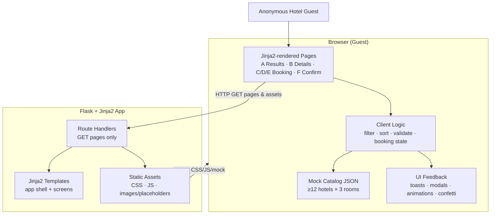
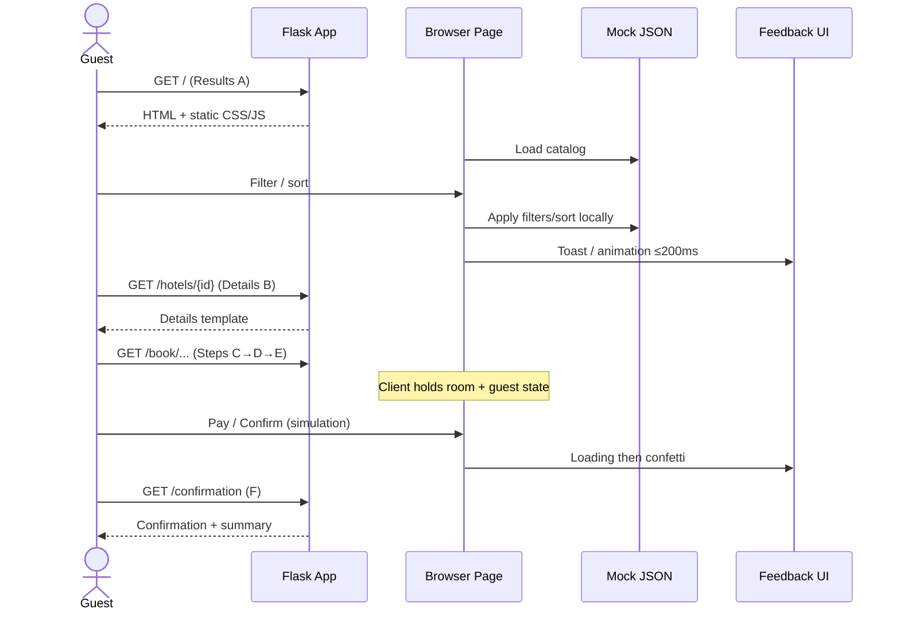

# Architecture

## Overview

This architecture defines a **Python web application** that serves an **Interactive Hotel Booking User Portal** for Jira epic **EP-1** (child stories EP-3–EP-14). A **Flask** app with **Jinja2** templates delivers multi-page HTML and static CSS/JS. All hotel and booking catalog data lives in **client-side mock JSON** (hardcoded JavaScript)—there is no database, authentication, remote hotel API, or real payment gateway.

Guests progress through: **Results (A)** → **Hotel Details (B)** → **Room Selection (C)** → **Guest Details (D)** → **Dummy Payment (E)** → **Confirmation (F)** with confetti. Filtering, sorting, form validation, and booking state are handled in the browser against the mock dataset so local interactions can meet the ~**200ms** feedback target. Stage 7 verification will use **Playwright** end-to-end tests against the served UI.

## Goals & Constraints (from requirements)

| Goal / Constraint | Architectural implication |
|-------------------|---------------------------|
| Flask + Jinja2 Python web app serves pages & static assets | Thin server: routing + template render + `static/` only |
| No DB, auth, real payments, or live hotel APIs | No ORM, sessions for login, or payment SDKs; mock data in JS |
| ≥12 hotels × 3 rooms in mock JSON | Single client-side catalog module; schema supports filters/details/booking |
| Filters: price, rating, amenities; sort by price; Clear filters | Client-side filter/sort engine on Results (A) |
| 3-step booking with step indicator | Shared booking shell for C/D/E; client state between steps |
| Visual feedback on every primary action | Shared UI feedback component (toast/modal/animation) |
| Confirmation + confetti; optional reference id | Confirmation page + lightweight confetti/animation asset |
| Responsive desktop / tablet / mobile | Responsive CSS in app shell; semantic HTML |
| ≤200ms local interactions | Sync filter/sort/step transitions; no network round-trips for catalog ops |
| Graceful empty / validation / `"Not Found"` | Defensive render helpers; empty-state UI; inline form errors |
| No secrets in UI or docs | No credentials in templates, static JS, or architecture docs |
| Stage 7 Playwright E2E | Stable routes, `data-testid` hooks, deterministic mock data |

## Component Diagram (mermaid)





## Components & Responsibilities

| Component | Responsibility |
|-----------|----------------|
| **Flask application factory / entry** | Create app, register blueprints/routes, configure static folder; local/dev runnable only |
| **Route handlers** | Map URLs to screens A–F; pass minimal template context (page title, hotel id for details); no business persistence |
| **Jinja2 templates (app shell)** | Shared layout: nav, responsive breakpoints, feedback region hooks, links across screens (EP-3) |
| **Results page (A)** | Hotel cards from mock data; wire filter/sort UI; empty state; navigate to details |
| **Hotel details page (B)** | Hotel info + 3 room types; “Select room” entry into booking flow |
| **Booking step pages (C/D/E)** | Step indicator (1 of 3); Room Selection → Guest Details → Dummy Payment; Back preserves selections |
| **Confirmation page (F)** | Booking summary, confetti, CTA back to results |
| **Mock catalog module (JS)** | Hardcoded ≥12 hotels × 3 rooms; fields for name, location, rating, amenities, prices, images/placeholders, room capacity/amenities |
| **Filter & sort engine (JS)** | Price range, rating, amenities multi-select, Clear filters; sort by price (low→high; optional high→low) |
| **Booking state manager (JS)** | Hold selected hotel/room, guest form fields, optional reference id across C→F without server session |
| **Form validation (JS)** | Inline validation for Guest Details (required names, email format, guests ≥ 1; optional phone) |
| **UI feedback layer (JS/CSS)** | Toasts, modals, animations for primary actions; payment loading; confetti on success (EP-13, EP-12) |
| **Display helpers (JS)** | Render missing mock fields as `"Not Found"` / placeholder; never crash |
| **Static CSS** | Responsive layout, card/list/booking/confirmation presentation |
| **Playwright E2E (Stage 7)** | Drive browse → filter/sort → details → 3-step book → confirm against live Flask server |

**Requirement mapping (summary):** FR1–2 → Flask + static/mock; FR3–7 → mock + Results filter/sort/empty; FR8 → Details; FR9–12 → booking C/D/E; FR13 → Confirmation; FR14–15 → feedback + Not Found; FR16–17 → no auth/secrets; NFRs → responsive CSS, client-side perf, Playwright.

## Data Flow

1. **Page load:** Guest requests a route → Flask returns Jinja2 HTML → browser loads CSS/JS (including mock catalog).
2. **Browse (A):** Client reads mock JSON → renders cards → guest applies filters/sort → engine recomputes in memory → UI updates with visual feedback (target ≤200ms). Empty matches → empty-state view.
3. **Details (B):** Navigation with hotel id (path or query) → template loads → JS resolves hotel from mock → shows hotel + 3 rooms; missing fields → `"Not Found"`.
4. **Booking (C→E):** Selecting a room seeds client booking state → Guest Details validates locally → Dummy Payment runs success-only simulation (loading feedback, no network payment call) → optional client-generated reference id.
5. **Confirmation (F):** Page shows summary from client state (or query/hash if needed for refresh resilience within mock scope) → confetti → CTA returns to Results.
6. **No server write path:** Flask never persists bookings, users, or payments; all catalog and booking draft data remain client-side for this capstone.

## Technology Choices (with rationale)

| Choice | Decision | Rationale |
|--------|----------|-----------|
| **Language / runtime** | Python 3 | Capstone default; Stage 5 implementation target |
| **Web framework** | **Flask** | Approved in requirements; minimal surface for serving multi-page HTML + static files without unused Django/FastAPI weight (no ORM, no API-first JSON backend) |
| **Templating** | **Jinja2** (Flask default) | Server-rendered shell and screen structure; keeps HTML maintainable while business data stays in JS mock JSON |
| **Why not FastAPI** | Rejected for primary UI | Excellent for APIs; this product is multi-page HTML with Jinja2, not a JSON API + SPA |
| **Why not Django** | Rejected | Heavier (admin, ORM, auth patterns) unused given no DB/auth |
| **Client data** | Hardcoded JS mock JSON | Matches EP-4 and “no persistent backend”; enables ≤200ms local filter/sort |
| **Client interactivity** | Vanilla JS (or minimal helpers) | Sufficient for filter/sort/forms/feedback; avoid SPA framework unless Design Review later approves |
| **Styling** | Static CSS (responsive) | Meet breakpoints without requiring a heavy design system |
| **Animations** | CSS + lightweight JS confetti | Satisfies EP-12/EP-13 without payment or analytics SDKs |
| **Persistence** | None | Out of scope; booking state in `sessionStorage`/`localStorage` or in-memory JS is an implementation detail for Back/Continue UX only—not a server DB |
| **Testing (Stage 7)** | Playwright MCP E2E + pytest for Flask routes/smoke | Browser journey coverage + light server health checks |

## Interfaces / Contracts

### HTTP routes (page contracts)

| Method | Path (illustrative) | Screen | Notes |
|--------|---------------------|--------|-------|
| `GET` | `/` or `/results` | A — Results | Lists hotels from client mock after load |
| `GET` | `/hotels/<hotel_id>` | B — Details | `hotel_id` must exist in mock; unknown id → graceful not-found UI |
| `GET` | `/book/<hotel_id>/room` | C — Room Selection | Step 1 of 3 |
| `GET` | `/book/<hotel_id>/guest` | D — Guest Details | Step 2 of 3 |
| `GET` | `/book/<hotel_id>/payment` | E — Dummy Payment | Step 3 of 3; simulation banner required |
| `GET` | `/confirmation` | F — Confirmation | Summary + confetti; CTA to results |

Exact path spelling may be refined in Design Review / impl-plan; contracts above are the intended screen set.

### Mock catalog schema (client)

```text
Hotel {
  id, name, location, rating, amenities[],
  priceRange { min, max } | displayPrice,
  images[] | placeholder,
  rooms: Room[3]
}
Room {
  id, name | type, capacity, price, amenities[], image | placeholder
}
```

Missing fields render as `"Not Found"` / placeholder—never throw.

### Booking draft (client-only)

```text
BookingDraft {
  hotelId, roomId,
  guest { firstName, lastName, email, phone?, guestsCount },
  referenceId?  // optional client-generated
}
```

### UI feedback contract

Primary actions emit at least one of: toast, modal, or animation within the interaction feedback budget (~200ms for local ops; brief loading allowed on simulated pay).

### Playwright E2E hooks (Stage 7)

Stable selectors (e.g., `data-testid` on filter controls, hotel cards, step Continue/Back, pay button, confirmation summary) so E2E can cover browse → filter/sort → details → C/D/E → F without brittle CSS-only selectors.

## Security & Secret Handling

- **No authentication** — anonymous guest only; do not introduce login, cookies for identity, or role checks.
- **No secrets** — do not embed API keys, tokens, or credentials in templates, static JS, mock data, README, or SDLC docs; never commit `api-conf.properties` or `.env` contents into documentation.
- **Payment simulation** — Dummy Payment must state clearly that no real charge occurs; do not collect or log real card numbers; if a mock card UI is shown for realism, use non-sensitive placeholders only (no Luhn-validated “real” PANs required).
- **Input handling** — Guest form values stay client-side for this scope; if any value is ever echoed in Jinja, use auto-escaping (Flask/Jinja2 default) to avoid XSS.
- **Dependency hygiene** — pin Flask and test deps reasonably; avoid unnecessary packages that broaden attack surface.
- **Docs sync** — redact any accidental secrets; mark missing config as `Not Found` rather than inventing credentials.

## Failure Modes & Resilience

| Failure / edge case | Behavior |
|---------------------|----------|
| Filters match zero hotels | Clear empty state + affordance to Clear filters |
| Invalid guest form fields | Inline validation; block Continue until valid |
| Missing/undefined mock fields | `"Not Found"` or graceful placeholder; UI stays up |
| Unknown `hotel_id` in URL | Dedicated not-found / back-to-results message (no crash) |
| Booking step reached without room selected | Block Continue on C; redirect or prompt to select |
| Client state lost (refresh mid-flow) | Graceful recovery: return to Results or Details; do not invent server-side booking recovery |
| Static asset 404 | Flask 404; keep templates free of hard dependency on optional images (use placeholders) |
| Flask process down | Local restart; document `flask run` / README start steps for Verify |
| Interaction slower than budget | Prefer sync in-memory filter/sort; avoid artificial delays except brief pay simulation; document console timing approach per NFR |

## Open Trade-offs

1. **In-memory vs `sessionStorage` for booking draft:** In-memory is simplest; storage survives refresh better for demo/Playwright. Prefer lightweight `sessionStorage` in implementation unless Design Review prefers pure memory + strict navigation.
2. **Optional high→low price sort:** Requirements allow low→high as minimum; high→low is a non-blocking preference—include if low effort.
3. **Amenity vocabulary:** Exact amenity strings are seed-data choices; keep a fixed enum-like list in mock for filter multi-select consistency.
4. **Booking reference id format:** Optional; e.g., `HB-` + short random token client-side—decide in impl-plan.
5. **Vanilla JS vs small library:** Vanilla preferred for scope; only add a library if confetti/feedback complexity justifies it in Design Review.
6. **Multi-page full reloads vs shared shell with partial enhancement:** Full multi-page Flask routes match Jinja2 strengths; keep catalog logic in shared static JS loaded on each page.
7. **Path style (`/hotels/<id>` vs query params):** Path params are clearer for Playwright and bookmarks; finalize in impl-plan.

**Stage gate:** This document is Architecture only. No production application code in Stage 2. Proceed to Design Review only after human approval of `architecture.md`.
